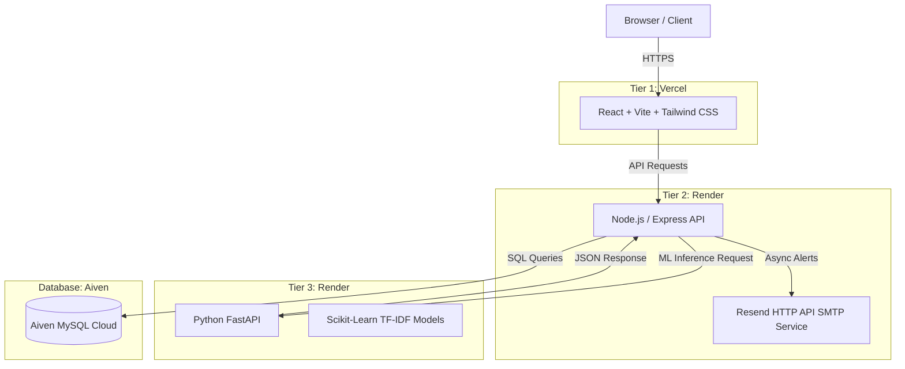
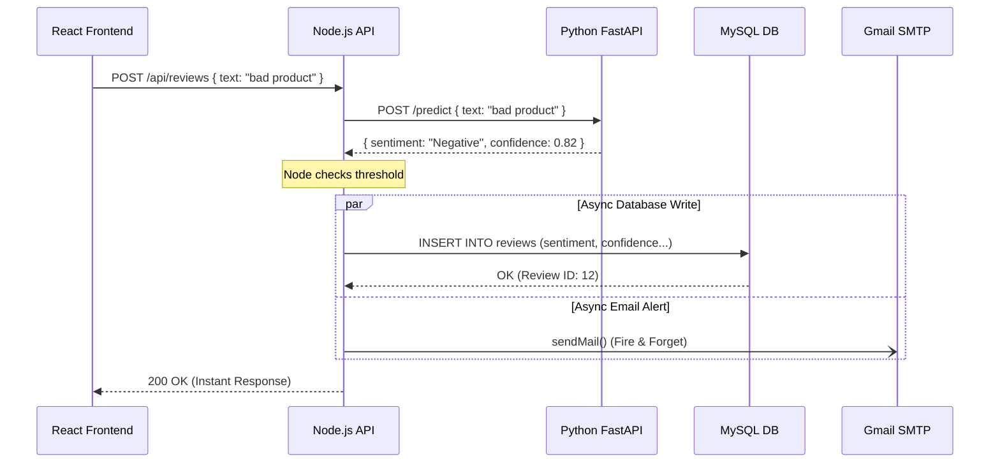

# Pulse — Architecture & System Design Document

This document provides a comprehensive technical overview of the Pulse Customer Feedback Intelligence Platform.

## 1. High-Level Architecture (Microservices)

Pulse uses a modern, decoupled **3-Tier Microservice Architecture**. This allows the frontend, the core business API, and the heavy Machine Learning computations to scale independently.

## 2. Core Components

### A. Frontend (React / Vite)
*   **Role**: Provides the user interface (Dashboard) for analysts to view and manage feedback.
*   **Key Tech**: React, Vite, Tailwind CSS, Recharts.
*   **Responsibilities**:
    *   State management (filtering positive vs negative reviews).
    *   Data visualization (Donut charts, metric counters).
    *   Handling CSV file uploads via `FormData`.

### B. Business Logic API (Node.js / Express)
*   **Role**: Acts as the central traffic controller and orchestrator.
*   **Key Tech**: Node.js, Express, `mysql2/promise`, `Resend HTTP API`.
*   **Responsibilities**:
    *   Routing and REST API endpoints (`GET /reviews`, `POST /reviews`).
    *   Database CRUD operations.
    *   **Asynchronous Alerting**: Evaluates ML responses and fires off non-blocking background emails if a threshold is breached.

### C. Machine Learning Inference Service (Python / FastAPI)
*   **Role**: Isolated computational microservice responsible strictly for Natural Language Processing (NLP).
*   **Key Tech**: Python 3.11, FastAPI, Uvicorn, Scikit-Learn, Pandas.
*   **Responsibilities**:
    *   Loading pre-trained serialized models (`.pkl` files) into memory on startup.
    *   Exposing a high-speed REST endpoint (`/predict`) to vectorize incoming text via TF-IDF and run Logistic Regression predictions.

### D. Database (Aiven MySQL)
*   **Role**: Persistent storage of reviews, batches, and configuration settings.
*   **Key Tech**: MySQL 8.0 (Managed Cloud).
*   **Responsibilities**:
    *   Enforcing relational integrity (Foreign Keys between `reviews` and `batches`).
    *   Preventing race conditions via `UNIQUE` constraints.

---

## 3. Data Flow Diagram (Review Submission)

This diagram shows the exact sequence of events when a user submits a review.

## 4. Key Engineering Decisions & Trade-offs

1.  **Asynchronous Email Alerts**: Sending emails via SMTP is slow and prone to timeouts (especially if credentials fail or the provider blocks the port). Instead of using `await` and freezing the user's browser, the email function is detached (Fire-and-Forget). The HTTP response is sent to the user immediately, and the email resolves in the background.
2.  **TF-IDF vs Deep Learning**: While LLMs (like GPT) are trendy, they are slow, expensive, and require GPUs. For a simple classification task (Sentiment/Aspect), a classical TF-IDF Vectorizer with Logistic Regression executes in single-digit milliseconds on a cheap 0.1 CPU cloud instance.
3.  **Database Concurrency**: To prevent duplicate "daily batches" from being created if multiple users upload CSVs at the exact same millisecond, the application relies on the database engine itself using `INSERT IGNORE` and a `UNIQUE` constraint on the batch label, avoiding traditional Time-Of-Check to Time-Of-Use (TOCTOU) bugs.
